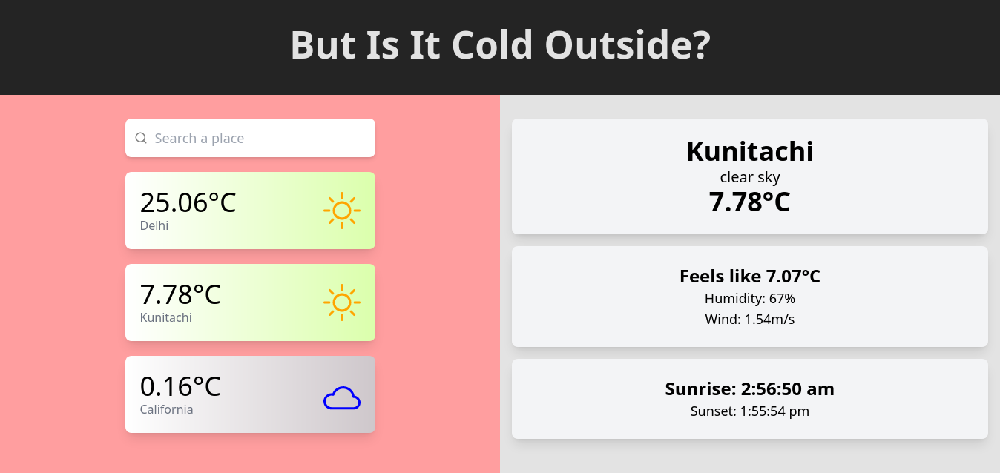

# Is It Cold Outside?

## About

Made using Preact (the leaner React) and the OpenWeatherMap API.
Global state management is done using the [teaful](https://github.com/teafuljs/teaful) library.

## Live Demo

[Is it cold outside?](https://korigamik.github.io/is-it-cold-outside)